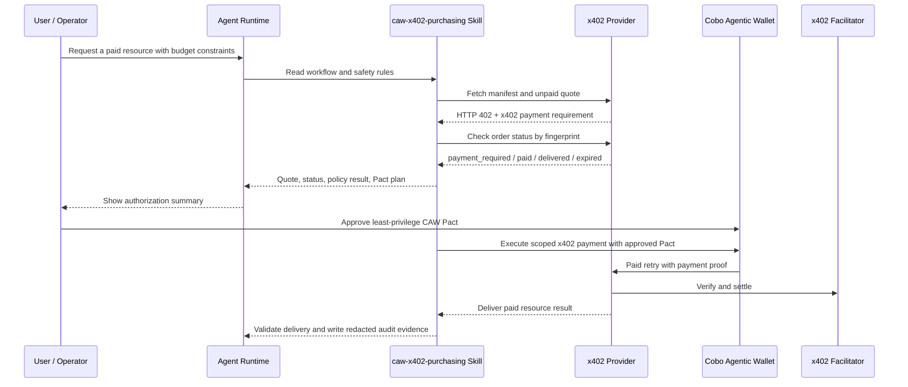

# CAW x402 Agent Commerce

[中文 README](./README.zh-CN.md)

Reusable agent-commerce toolkit for buying x402 paid resources through Cobo Agentic Wallet.

The project shows how an existing agent runtime such as Codex or Claude Code can inspect an x402 payment requirement, apply user constraints, request a CAW Pact, execute a scoped payment, recover delivery safely, validate the result, and write redacted audit evidence.

## What It Is

`caw-x402-agent-commerce` is not a standalone vertical agent app. It is a hackathon-ready reference project for agentic commerce:

- `backend/`: seller-side x402 paid-resource provider.
- `agents/`: buyer-side agent executor for quote review, CAW Pact planning, payment execution, delivery validation, and audit output.
- `skills/`: reusable agent runtime skill instructions.
- `examples/risk-report/`: the example paid resource used to prove the flow.
- `docs/`: architecture, design context, operator notes, and live-test evidence.
- `frontend/`: lightweight browser demo console served by the provider at `/demo`.

The current example paid resource is `GET /risk-report?address=...`. It exists to demonstrate the commerce flow; the reusable project boundary is the purchasing capability.

## Hackathon Fit

- Agent + funds scenario: an existing agent runtime buys an x402 paid resource from a provider.
- Real funds execution: the demo executes a Solana Devnet USDC x402 payment instead of stopping at a mock authorization screen.
- CAW critical path: Cobo Agentic Wallet is the funds authorization and execution boundary. The agent requests a least-privilege CAW Pact, waits for wallet approval, then pays only through that approved Pact.
- Safety value: CAW scopes wallet access by chain, token, destination address, amount, transaction count, and time window; the project adds quote review, provider-status recovery, duplicate-payment guard, and redacted audit evidence around that wallet boundary.
- Runnable prototype: the repo includes a local provider, buyer executor, reusable purchasing skill, browser demo console, automated checks, and recorded desktop/mobile demos.

## Interaction Example

```text
User:
Buy the risk report for 0x0000000000000000000000000000000000000001
with a max budget of 0.005 USDC.

Agent:
  OK Provider manifest checked
  OK x402 quote received: 0.005 USDC on Solana Devnet
  OK Payee, token, network, resource, and max price match user constraints
  OK Provider status checked: payment_required
  -> CAW Pact requested with one-payment, least-privilege scope

User approves the Pact in Cobo Wallet.

Agent:
  OK Pact active
  OK x402 payment executed
  OK Delivery received and validated
  OK Redacted audit evidence written

Result:
  Risk report delivered
  Paid: 0.005 USDC
  Network: Solana Devnet
  Audit: agents/audits/...
```

## Architecture

```text
User / Operator
  -> Agent Runtime
  -> skills/caw-x402-purchasing
  -> agents buyer executor
  -> backend x402 paid-resource provider
  -> x402 Facilitator
  -> CAW Pact-scoped wallet action
  -> delivery validation + redacted audit
```

## How It Works



The trust boundary is split across three layers:

- The agent decides whether the x402 quote matches the user's intent and constraints.
- CAW Pact approval scopes the wallet action by chain, token, payee, amount, transaction count, and time window.
- The provider owns order status, settlement handling, delivery, recovery, and audit-friendly state.

## Quick Start

Install dependencies:

```bash
npm run install:all
```

Run checks:

```bash
npm run check
npm run test
```

Start the provider:

```bash
npm run backend:provider
```

Open the browser demo console:

```text
http://localhost:4021/demo
```

The console is for operator/reader visibility. It shows provider capability, quote, status, and Pact-plan shape for the demo provider, and it generates a copyable purchase-intent prompt. The prompt follows a task/spend-plan/wallet-authorization/safety-boundary shape and points the agent to `skills/caw-x402-purchasing`; the skill owns the concrete workflow. The console does not call Codex directly or execute payments from the browser.

In another terminal, run quote/precheck only through the skill-local entrypoint:

```bash
npm run skill:precheck -- \
  --url 'http://localhost:4021/risk-report?address=0x0000000000000000000000000000000000000001' \
  --max-price-usdc 0.005
```

Do not run a live payment flow unless the operator has given an end-to-end purchase intent with budget and provider constraints. Cobo Wallet Pact approval remains the funds authorization step.

## Demo Flow

1. Start `backend/`.
2. Open `http://localhost:4021/demo` for the browser demo console.
3. Use the page to inspect the example provider's manifest, quote, status, and Pact-plan shape.
4. Copy the generated purchase-intent prompt into Codex, Claude Code, or another runtime that has the skill installed.
5. The agent runtime reads `skills/caw-x402-purchasing` and lets the skill drive quote review, status recovery, Pact planning, payment, delivery validation, and redacted audit evidence.
6. For an end-to-end purchase request, the agent submits the CAW Pact request after quote/status/policy checks pass, then tells the operator to approve it in Cobo Wallet. Cobo Wallet approval is the funds authorization; after the Pact is active, the agent uses the approved Pact for payment unless the quote, policy, or provider status changes.

## Demo Evidence

- [Desktop demo recording](./demo/demo.mp4)
- [Mobile demo recording](./demo/demo_mobile.MP4)
- [CAW wallet transaction screenshot](./demo/transaction-screenshot.png)
- [Solana Devnet transaction on Solscan](https://solscan.io/tx/3UCmerxaLzXYzzSuBXw3hr19W717N5zn792ig6LD1pcgxUT5Hd8P7fMtcwP6ncMdEdK8wyJAagfPkfkN8S3QdF9n?cluster=devnet)
- Network: Solana Devnet
- Agent / CAW wallet address: `7kuW3nm9Yw7c3SAQEZpBsyVgNywpabJekeXjKuYt2Z4b`
- Token: USDC
- Amount: 0.005 USDC
- CAW / x402 implementation entrypoints:
  - `skills/caw-x402-purchasing/SKILL.md`
  - `skills/caw-x402-purchasing/scripts/purchase-with-caw-fetch.mjs`
  - `agents/src/consumer/caw.ts`
  - `backend/src/provider/routes.ts`
- Key configuration: `backend/.env.example` documents `PROVIDER_PAY_TO_ADDRESS`, `X402_NETWORK`, `X402_PRICE_USDC`, `CAW_WALLET_ID`, `CAW_AGENT_CREDENTIAL`, and `CAW_X402_PAYMENT_HEADER_COMMAND`.

## Safety Rules

- Quote first, pay later.
- Fail closed on amount, token, network, payee, method, or resource mismatch.
- Query provider status before submitting a new Pact.
- Prefer recovery when payment or delivery evidence already exists.
- Never persist CAW credentials, pact-scoped API keys, raw payment payloads, private keys, seed phrases, or reusable payment proofs.

## Docs

- [Architecture](./docs/architecture.md)
- [Context](./docs/CONTEXT.md)
- [Implementation plan](./docs/design/caw-x402-agent-commerce-implementation-plan.md)
- [Operator runbook](./docs/operator-runbook.md)
- [Live-test evidence](./docs/live-test-evidence.md)
- [Chinese submission checklist](./docs/submission-guide.zh-CN.md)
