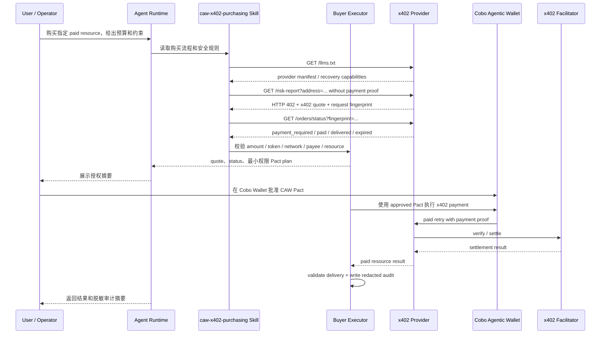

# CAW x402 Agent Commerce

面向现有 Agent Runtime 的安全支付能力，让 Codex、Claude Code、Cursor 等 Agent 在遇到 x402 付费资源时，可以通过 Cobo Agentic Wallet 安全、稳定、可审计地完成付款。

这个项目的重点不是重新实现一个 Agent，而是给已经具备推理和工具调用能力的 Agent 增加一层 commerce execution layer：识别 402 quote、审查付款约束、申请最小权限 CAW Pact、执行 scoped payment、恢复交付结果，并写入脱敏审计证据。

## 它解决什么问题

现有 Agent Runtime 已经能理解用户意图、读取文档、调用工具和执行脚本，但当它们访问机器可读的付费资源时，仍缺少一套安全支付边界：

- Agent 可能不知道应该如何理解 HTTP 402 / x402 quote。
- 用户需要在付款前确认金额、token、network、payee 和资源是否匹配。
- 钱包授权应该是最小权限，而不是给 Agent 开放完整钱包能力。
- 付款失败、网络中断或交付失败时，Agent 不能盲目重复付款。
- 付款和交付结果需要留下可审计但不可复用的证据。

`caw-x402-agent-commerce` 提供的就是这层能力。

## 方案概览

```text
User / Operator
  -> Existing Agent Runtime
  -> caw-x402-purchasing Skill
  -> Buyer-side Commerce Executor
  -> x402 Paid Resource Provider
  -> x402 Facilitator
  -> CAW Pact-scoped Wallet Action
  -> Delivery Validation
  -> Redacted Audit Evidence
```

Agent Runtime 负责理解用户意图、读取 skill、决定是否需要购买，并向用户展示 quote 和授权摘要。

本项目负责确定性支付执行：provider capability discovery、x402 quote parsing、付款约束校验、provider status recovery、CAW Pact plan、scoped payment、delivery validation 和 audit record。

## 交互流程



## 核心原理

这个项目把一次 Agent 付款拆成三个边界：

- **Agent 决策边界**：Agent 读取用户意图、provider manifest 和 x402 quote，只负责判断“是否应该买、是否符合约束、下一步该做什么”。
- **CAW 授权边界**：用户不是把完整钱包交给 Agent，而是在 Cobo Wallet 里批准一个最小权限 Pact。Pact 限定 chain、token、payee、amount、次数和时间窗口。
- **Provider 交付边界**：x402 payment 只证明付款，Provider 仍然负责 order status、delivery、recovery 和可审计状态。

因此安全策略不是“让 Agent 自动花钱”，而是：

```text
先让 Agent 看懂 quote
  -> 再让用户批准最小权限 Pact
  -> 最后只在 Pact 范围内付款
  -> 付款后优先恢复交付结果
  -> 全程留下脱敏 audit evidence
```

状态流：

```text
requested
-> manifest_checked
-> quoted
-> provider_status_checked
-> intent_planned
-> pact_submitted
-> pact_approved
-> payment_executed
-> delivered / delivery_recovered
-> validated
-> audited
```

## 项目模块

- `backend/`: seller-side x402 付费资源 provider，当前示例资源是 `GET /risk-report?address=...`。
- `agents/`: buyer-side commerce executor，负责 quote review、CAW Pact flow、付款执行、交付验证和审计输出。
- `skills/`: 可安装到 Codex、Claude Code 等 Agent Runtime 的 skill 指令和辅助脚本。
- `examples/risk-report/`: 示例付费资源，用来证明完整支付链路。
- `docs/`: 架构、设计上下文、operator runbook、live-test evidence。
- `frontend/`: 轻量浏览器 demo console，由 provider 通过 `/demo` 提供。

`/risk-report` 只是示例付费资源，不是产品本体。真正的项目边界是：让现有 Agent Runtime 能安全购买 x402 paid resources。

## 核心能力

- **Quote-first payment**: 先解析和展示 x402 quote，再允许付款。
- **Fail-closed policy**: amount、token、network、payee、method、resource 任一不匹配就停止。
- **Least-privilege CAW Pact**: 根据购买意图和 provider quote 生成最小权限钱包授权。
- **Duplicate payment guard**: 付款前检查 provider status、payment id、fingerprint 和本地 audit evidence，避免重复付款。
- **Delivery recovery**: 已付款但未交付时优先恢复结果，而不是重新付款。
- **Redacted audit evidence**: 记录 payment id、Pact id、transaction reference、delivery hash、validation result，但不保存可复用支付凭证或密钥。
- **Agent-readable provider manifest**: 通过 `/llms.txt` 暴露付费资源、约束和恢复能力，方便 Agent Runtime 决策。

## 快速开始

安装依赖：

```bash
npm run install:all
```

运行检查：

```bash
npm run check
npm run test
```

启动 provider：

```bash
npm run backend:provider
```

打开浏览器 demo console：

```text
http://localhost:4021/demo
```

这个 console 用于 operator / 评委观察和讲解。它展示 demo provider 的 capability、quote、status 和 Pact plan 形态，并生成一段可复制的 purchase-intent prompt。prompt 采用 task / spend plan / wallet authorization / safety boundary 的结构，只把 Agent 指向 `skills/caw-x402-purchasing`；具体流程由 skill 决定。它不会直接调用 Codex，也不会从浏览器执行付款。

另开一个终端，通过 skill-local 入口只运行 quote / precheck：

```bash
npm run skill:precheck -- \
  --url 'http://localhost:4021/risk-report?address=0x0000000000000000000000000000000000000001' \
  --max-price-usdc 0.005
```

除非 operator 已经给出端到端购买意图、预算和 provider 约束，否则不要运行真实 CAW 付款流程。Cobo Wallet 中的 Pact 批准仍然是资金授权步骤。

## Demo Flow

1. 启动 `backend/`。
2. 打开 `http://localhost:4021/demo` 查看浏览器 demo console。
3. 用页面观察 example provider 的 manifest、quote、status 和 Pact plan 形态。
4. 将生成的 purchase-intent prompt 复制到已安装 skill 的 Codex、Claude Code 或其他 runtime。
5. Agent Runtime 读取 `skills/caw-x402-purchasing`，由 skill 驱动 quote review、status recovery、Pact planning、payment、delivery validation 和 redacted audit evidence。
6. 对端到端购买请求，Agent 在 quote/status/policy 检查通过后提交 CAW Pact 请求，并提醒 operator 到 Cobo Wallet 批准。Cobo Wallet 里的 Pact 批准才是资金授权。Pact active 后，如果 quote、policy 和 provider status 没有变化，Agent 再使用这个已批准 Pact 执行付款，不再要求聊天里重复确认。

## Demo Evidence

- [桌面端 demo 录屏](./demo/demo.mp4)
- [移动端 demo 录屏](./demo/demo_mobile.MP4)
- [Solana Devnet 交易哈希 / Solscan](https://solscan.io/tx/3UCmerxaLzXYzzSuBXw3hr19W717N5zn792ig6LD1pcgxUT5Hd8P7fMtcwP6ncMdEdK8wyJAagfPkfkN8S3QdF9n?cluster=devnet)

## 与“实现一个 Agent”的区别

这个项目不把重点放在调用 LLM SDK 实现一个新的 Agent loop。Codex、Claude Code、Cursor 等现有 runtime 已经能完成意图理解、工具选择和用户交互。

本项目补齐的是它们缺少的安全支付执行层：

```text
Existing Agent Runtime:
  understand intent
  read skill instructions
  decide whether to buy
  ask user for approval

CAW x402 Agent Commerce:
  discover provider capability
  parse x402 quote
  enforce payment constraints
  plan CAW Pact authorization
  execute scoped payment
  recover delivery safely
  validate result
  write audit evidence
```

如果未来需要，也可以增加 Anthropic SDK、Claude Agent SDK 或其他 Agent SDK 的 adapter，但那只是兼容性示例，不是项目主线。

## 安全规则

- 先 quote，后付款。
- quote 与用户约束不一致时停止。
- provider payee、network、asset 变化时重新获取 quote 和 CAW Pact。
- 付款前必须查询 provider status。
- 已付款或已交付时优先 recovery，不重复付款。
- 不输出、不持久化 CAW credential、pact-scoped API key、raw payment payload、private key、seed phrase 或可复用 payment proof。

## 文档

- [Architecture](./docs/architecture.md)
- [Context](./docs/CONTEXT.md)
- [Implementation plan](./docs/design/caw-x402-agent-commerce-implementation-plan.md)
- [Operator runbook](./docs/operator-runbook.md)
- [Live-test evidence](./docs/live-test-evidence.md)
- [黑客松提交检查清单](./docs/submission-guide.zh-CN.md)
