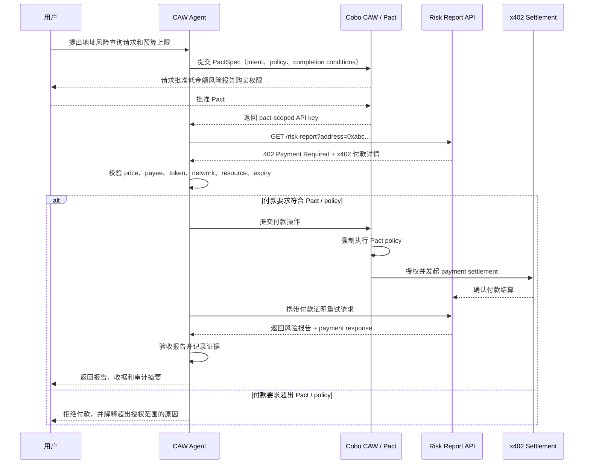

# x402 Paywall + CAW Agent 链上地址风险报告 PRD

状态：MVP 设计草案

## 背景

用户在转账、授权合约或与陌生地址交互前，经常需要判断目标链上地址是否存在风险。现实中，这通常需要用户手动查询多个风控数据源；用户也不一定知道，是否值得为一次风险查询支付费用。

本项目设计一个最小化的 agent commerce 闭环：用户授权 Agent 在严格预算内购买一次链上地址风险报告。服务提供方用 x402 paywall 保护 API。Agent 收到付款要求后，先判断该要求是否符合用户批准的 CAW Pact / policy / budget；只有在符合授权范围时才完成付款，并返回报告和审计记录。

本任务的核心学习点不是“自动付款”，而是：Agent 能否在明确授权、预算控制、结果验收和可审计记录下，完成一次付费任务。

## 用户场景

目标用户：希望在链上操作前快速检查地址安全性的 Web3 用户。

示例请求：

```text
帮我查询 0xabc... 是否是高风险地址，单次预算不要超过 0.005 USDC。
```

Agent 调用一个付费风险报告 API。只有当 x402 付款要求符合用户已批准的 policy 时，Agent 才付款、获取报告、验收结果，并把风险报告和付款收据一起返回给用户。

## MVP 目标

- 提供一个受 x402 保护的风险报告 API。
- Agent 请求 API 后收到 `402 Payment Required`。
- Agent 能解析付款要求。
- Agent 能根据已批准的 CAW Pact 校验价格、收款方、token、network、resource 和过期时间。
- CAW 作为付款操作的最终强制执行层。
- 完成 x402 payment settlement，并获取风险报告。
- 根据简单验收规则校验报告。
- 记录授权、付款、结果和验收证据。

## 非目标

- 不做完整 marketplace。
- 不做多服务商竞价。
- 不训练真实风控模型。
- 不处理高价值支付。
- 不做生产级资金托管配置。
- MVP 不实现 ERC-8183 escrow。
- MVP 不实现 ERC-8004 reputation registry。
- MVP 不做正式争议仲裁系统。

## 角色与责任

| 角色 | 责任 |
| --- | --- |
| 用户 | 提供目标地址，批准 Agent 的预算和权限范围。 |
| CAW Agent | 请求 API，读取 x402 付款要求，检查 policy，提交允许范围内的付款操作，获取结果并验收报告。 |
| Cobo CAW / Pact | 强制执行 scoped delegation、spend limit、address allowlist、allowed operation 和过期时间。 |
| 风险报告 API 服务方 | 通过 x402 paywall 出售结构化链上地址风险报告。 |
| x402 Facilitator / Settlement Layer | 验证并结算付款。 |
| 验收方 | MVP 中由 Agent 自动验收结构化字段；异常情况交给用户。 |
| 仲裁方 | MVP 不设置正式仲裁方；失败进入拒绝、重试限制、退款请求或人工复核。 |

## Commerce Flow



## Pact 与 Policy 设计

MVP 中，Pact 应该在付款发生前约束 Agent 的权限范围。

| 维度 | MVP 规则 |
| --- | --- |
| 任务意图 | 为用户指定地址购买一次风险报告。 |
| 单次预算 | 最高 0.005 USDC。 |
| 总预算 | 当前 Pact 最高 0.02 USDC。 |
| 时间窗口 | 30 分钟内有效。 |
| Network | 只允许指定测试网或已批准的低风险网络。 |
| Token | 只允许 USDC。 |
| 收款方 | 只允许已知风险报告 API 服务方地址。 |
| Resource | 只允许风险报告 endpoint。 |
| 完成条件 | 成功返回一份有效报告、预算耗尽、Pact 过期或用户撤销 Pact。 |

重要区分：

- CAW Pact 是最终强制执行边界。它必须拒绝超出已批准 delegation 的操作。
- Agent 前置校验是支付决策和解释边界。Agent 不应该把所有 x402 付款要求都盲目提交给 CAW，而应该先判断付款要求是否符合用户意图和 policy，并解释为什么接受或拒绝一次付款请求。

## 报告验收标准

Agent 不应该把 HTTP 200 当成成功的唯一标准。只有满足以下条件，报告才算验收通过：

| 检查项 | 规则 |
| --- | --- |
| 地址一致 | 返回的 `address` 必须等于用户请求的地址。 |
| 必要字段 | 响应必须包含 `riskScore`、`riskLevel`、`labels`、`generatedAt`。 |
| 新鲜度 | `generatedAt` 对当前任务来说不能过旧。 |
| 风险等级 | `riskLevel` 必须是 `low`、`medium`、`high` 或 `unknown`。 |
| 收据 | 必须存在 payment response 或 settlement record。 |
| 失败状态 | 缺少字段、地址不一致或缺少收据时，标记为验收失败。 |

## 失败处理

| 失败类型 | 处理方式 |
| --- | --- |
| 报价超过预算 | Agent 拒绝付款，并解释预算不匹配。 |
| 收款方不在 allowlist | Agent 拒绝付款。 |
| Token 或 network 不匹配 | Agent 拒绝付款。 |
| Pact 过期或被撤销 | Agent 停止任务。 |
| 付款成功但 API 没有返回结果 | 记录付款收据，进入人工复核或退款请求。 |
| API 返回结果格式错误 | 标记验收失败，不再自动发起下一次付款。 |
| 反复出现 402 循环 | 达到较小重试次数后停止，避免重复付款尝试。 |

## 证据与审计记录

每次运行至少记录：

- 用户请求。
- Pact ID 和 policy 摘要。
- 请求的 resource。
- x402 payment requirement。
- 付款金额、token、network、payee。
- settlement response 或交易 hash。
- 风险报告 hash。
- 验收结果。
- 如失败，记录失败原因或人工复核状态。

链上记录可以证明付款和结算状态，但不能单独证明服务质量。因此 MVP 需要同时记录付款证据和交付验收证据。

## 协议比较

| 协议 | 解决什么问题 | 在本 MVP 中的位置 |
| --- | --- | --- |
| x402 | HTTP 请求级支付。服务端通过 `402 Payment Required` 返回付款要求；客户端付款后重试请求并获取资源。 | MVP 主支付协议。它适合“一次付费 API 响应”这种场景。 |
| ERC-8183 | 任务级 commerce，包含 budget、provider、escrow、submission、evaluator、completion、rejection 和 payment release。 | MVP 不实现。更适合交付物主观、周期更长、需要验收和仲裁的任务。 |

ERC-8004 是未来可扩展方向，可用于 agent 身份、发现、声誉和验证。它不替代 x402 payment，而是帮助回答“用户是否应该信任某个 provider 或 agent”。

MPP 是另一个 machine-to-machine payment 方向。对于本 MVP，x402 更简单，因为任务可以直接建模为一个 HTTP paid resource。

## 关键决策

1. 使用 x402 作为主支付协议，因为交付物是一次付费 API 响应。
2. 使用 CAW Pact 作为最终授权和强制执行层。
3. 保留 Agent 付款前 policy 校验，用于提升决策质量、解释能力和审计语义。
4. 使用自动验收，因为风险报告是结构化数据。
5. MVP 不实现 escrow 或正式仲裁。

## 最脆弱假设

本方案假设：风险报告可以通过结构化字段和简单一致性检查自动验收。

如果交付物变成主观结果，例如自然语言调查报告，那么 x402 本身就不够了。设计应该转向 job、escrow 和 evaluator 模型，例如 ERC-8183。

## 成功标准

- Agent 能收到并理解 x402 付款要求。
- Agent 能拒绝超出已批准 policy 的付款要求。
- Agent 提交付款操作时，CAW 能强制执行 Pact。
- 符合 policy 的请求可以成功完成 payment settlement。
- API 在付款后返回风险报告。
- Agent 在报告展示给用户前完成验收。
- 最终输出包含结果、收据和审计摘要。
- 失败场景不会导致重复付款或未授权付款。

## 参考资料

- x402 HTTP 402 docs: https://docs.x402.org/core-concepts/http-402
- Cobo CAW Pacts: https://www.cobo.com/products/agentic-wallet/manual/security/pact-mechanism
- MPP: https://mpp.dev/
- ERC-8004: https://eips.ethereum.org/EIPS/eip-8004
- ERC-8183: https://eips.ethereum.org/EIPS/eip-8183
