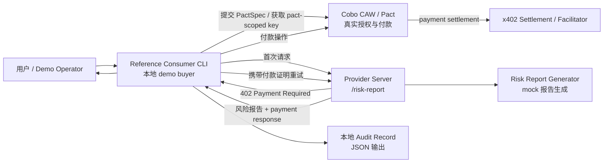
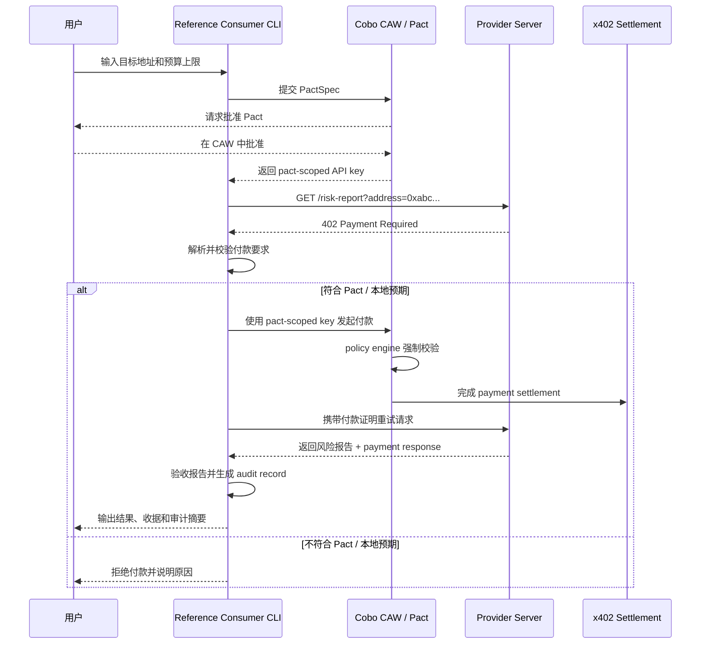
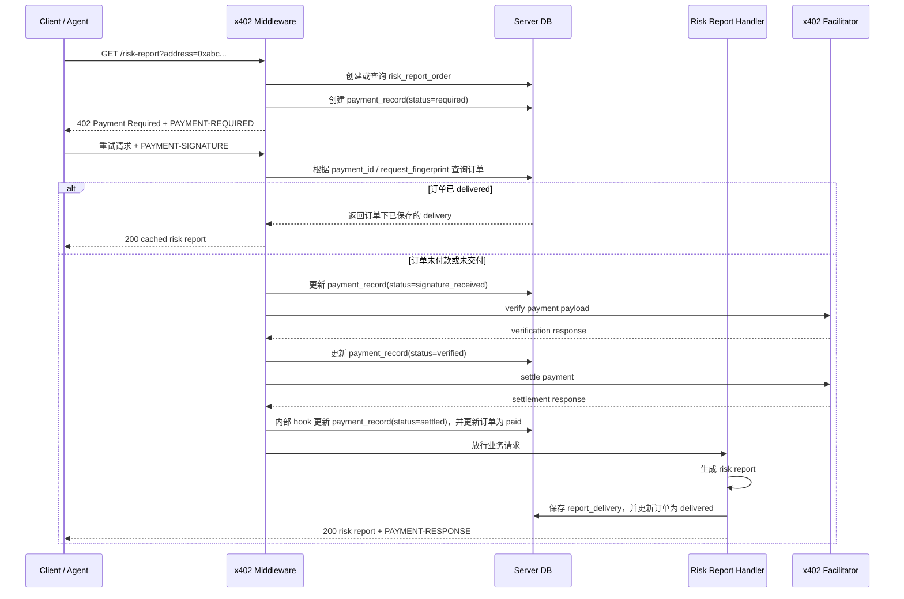

# x402 Paywall + CAW Agent 链上地址风险报告技术方案

状态：技术方案草案

关联 PRD：[x402 Paywall + CAW Agent 链上地址风险报告 PRD](./x402-caw-risk-report-prd.md)

## 1. 方案结论

本 MVP 不只实现服务端 API，也提供一个轻量级 reference consumer CLI。

服务端 API 是产品主体，负责对外提供受 x402 保护的风险报告服务。reference consumer CLI 不是要替真实用户实现他们自己的 Agent，而是作为一个可复现的 demo buyer，证明“用户侧 Agent 如何在真实 CAW Pact 约束下完成 x402 付款、重试请求、获取结果、验收报告和生成审计记录”。

本方案不使用 LangGraph。当前流程是确定性的支付和验收流程，不需要 agent workflow graph、planner、多工具编排或长期记忆。使用 LangGraph 会让学习重点从 Payment / Commerce / Settlement 偏移到 agent framework。

### 1.1 实现技术栈与 demo 落点

首个可运行 demo 放在 `experiments/x402-caw-risk-report/`，与 `hackathon/` 设计文档和 `tasks/` 课程记录分离。

第一版实现采用 TypeScript + Hono + Node.js：

- Provider Server 使用 Hono 暴露 `/health` 和后续受 x402 保护的 `/risk-report`。
- Reference Consumer CLI 使用 TypeScript 编写，后续负责请求、解析 402、前置校验、CAW 付款、重试和审计输出。
- 共享逻辑放在 `src/shared/`，便于未来 Next.js UI 复用配置、类型、payment requirement、地址校验、fingerprint 和验收逻辑。
- 本地运行输出限定在 `data/` 和 `audits/`，SQLite 文件、审计 JSON、CAW credential、pact-scoped API key、钱包私钥、seed phrase 和真实私有账户标识都不进入 git。

本 slice 不引入 Next.js，因为当前 MVP 还没有浏览器 UI；未来只有在需要 dashboard 或用户交互页面时再加入。

## 2. 系统边界

| 模块 | 是否实现 | 形态 | 责任 |
| --- | --- | --- | --- |
| Provider Server | 是 | 长运行 HTTP 服务 | 提供 `/risk-report`，通过 x402 paywall 收费。 |
| x402 Seller Middleware | 是 | 服务端 middleware | 返回 402 付款要求，验证付款证明，放行已付款请求。 |
| Risk Report Generator | 是 | 服务端内部模块 | 生成 deterministic mock 风险报告。 |
| Reference Consumer CLI | 是 | 本地一次性 CLI | 模拟用户侧 Agent，跑通请求、付款、重试、验收和审计。 |
| Cobo CAW / Pact | 是，真实集成 | 外部钱包与授权系统 | 提交 Pact、等待批准、使用 pact-scoped API key 执行付款。 |
| 真实风险数据源 | 否 | 不接入 | MVP 不依赖第三方风控 API。 |
| LangGraph / Agent Framework | 否 | 不接入 | 当前流程不需要复杂 agent 编排。 |
| ERC-8183 Escrow | 否 | 不接入 | 本 MVP 是请求级付费 API，不是任务级 escrow。 |

## 3. 架构图



## 4. 运行时流程



## 5. Provider Server 设计

### 5.1 API

```text
GET /risk-report?address=<evm_address>
```

请求参数：

| 参数 | 类型 | 规则 |
| --- | --- | --- |
| `address` | string | 必填，EVM 地址格式，`0x` 开头，20 bytes。 |

未付款或付款无效时：

- 返回 `402 Payment Required`。
- 响应中包含 x402 payment requirement。
- requirement 应表达价格、network、token、payee、resource 等信息。

付款有效时：

```json
{
  "address": "0xabc...",
  "riskScore": 72,
  "riskLevel": "medium",
  "labels": ["new-counterparty", "contract-interaction"],
  "generatedAt": "2026-05-31T12:00:00Z",
  "method": "deterministic-mock-v1"
}
```

### 5.2 x402 Paywall 配置

服务端使用 x402 官方 seller middleware / wrapper，而不是手写 402 协议细节。

#### 5.2.1 Middleware 的基本原理

x402 seller middleware 位于 HTTP 请求进入业务 handler 之前。它负责把普通 API 变成付费 API：

```text
Client request
  -> x402 middleware
    -> 没有付款证明：返回 402 Payment Required
    -> 有付款证明：调用 facilitator / scheme 验证并结算
      -> 验证 / 结算失败：返回错误
      -> 验证 / 结算成功：放行业务 handler
  -> risk-report handler
  -> 返回业务结果
```

关键点：

- 服务端仍然写普通业务 handler，例如 `/risk-report`。
- x402 middleware 根据 route config 生成 payment requirement。
- 客户端第一次请求通常不会带付款证明，因此会收到 `402 Payment Required`。
- 客户端付款后重试请求，并在 header 中携带付款证明。
- middleware 会验证付款证明，并通过 facilitator 或本地 scheme 完成 settlement。
- 付款有效后，middleware 才会把请求放行到业务 handler。

因此，服务端业务代码不需要手写“如何组装 402、如何验签、如何调用结算”的底层逻辑，但仍然需要设计自己的业务状态、付款记录、幂等重试和审计记录。

建议配置：

| 配置项 | MVP 值 |
| --- | --- |
| Resource | `/risk-report` |
| Price | `0.005 USDC` |
| Network | 选择 x402 和 CAW 都支持的 EVM 测试网 |
| Token | USDC |
| PayTo | 服务方收款地址 |
| Description | `On-chain address risk report` |
| MIME type | `application/json` |

#### 5.2.2 Payment Scheme 选择

MVP 使用 `exact` scheme。

原因：

- 风险报告是固定价格 API。
- 请求成本在执行前已经明确。
- 用户和 Agent 都能在付款前判断是否符合预算。
- 不需要根据 token usage、计算时间或返回字节数动态计费。

`upto` scheme 更适合 AI 推理、按 token 计费或按计算量计费的接口。`batch-settlement` 更适合高频小额调用。它们都不是本 MVP 第一版需要解决的问题。

#### 5.2.3 Lifecycle Hooks 与服务端记录

x402 middleware 负责 payment verification 和 settlement，但服务端仍然应该通过 lifecycle hooks 或业务 handler 保存本地记录。

建议使用的时机：

| 时机 | 用途 |
| --- | --- |
| 生成 402 时 | 记录一次 payment attempt，可选。 |
| `onAfterSettle` | settlement 成功后记录 payment record。 |
| 业务 handler 返回报告后 | 保存 delivery record 和 report hash。 |
| settlement 失败时 | 记录失败原因，便于排查。 |

设计原则：

- 付款记录由服务端保存，不能只依赖链上浏览器或 facilitator 返回值。
- 服务端记录只证明“这次请求完成了付款和交付”；用户侧 Agent 仍然需要保存自己的授权、验收和审计记录。
- 服务端和用户侧 audit record 是互补关系，不是二选一。

### 5.3 Provider Server 付款与记录流程

服务端需要显式设计本地状态，否则“用户已经付款但响应丢失 / 重试请求 / 重复提交付款证明”这些场景会不清楚。

#### 5.3.1 服务端状态模型

服务端状态应围绕订单建模，而不是只保存几张流水表。

本 MVP 的业务订单是一次 `risk_report_order`：用户为某个链上地址购买一份风险报告。payment record 和 report delivery 都应该挂在这个订单下面。

建议 MVP 保存三类记录：

| 记录 | 作用 |
| --- | --- |
| `risk_report_orders` | 业务主表，表示一次风险报告购买订单。 |
| `payment_records` | 订单下的支付记录，覆盖付款要求、签名提交、验证和结算结果。 |
| `report_deliveries` | 订单下的交付记录，记录返回给用户的报告。 |

MVP 采用本地持久化的轻量存储，不接远程数据库。

推荐实现：

- 使用 SQLite 文件，例如 `data/risk-report-demo.sqlite`。
- SQLite 是本地文件型数据库，服务重启后记录仍然存在。
- 对演示来说，它比纯内存 Map 更容易验证“付款后重启服务仍能查到记录”。
- 如果想进一步简化，也可以用 JSONL 文件，但查询 `payment_id + request_fingerprint` 时会更麻烦。

因此，技术方案默认使用 SQLite；不引入 Postgres、MySQL、Redis 或云数据库。

#### 5.3.2 建议字段

`risk_report_orders`：

| 字段 | 含义 |
| --- | --- |
| `id` | 服务端订单 id，例如 `rro_...`。 |
| `client_order_id` | 客户端传入的逻辑订单 id，可选。 |
| `payment_id` | x402 payment-identifier extension 中的 payment id。 |
| `request_address` | 用户查询的地址。 |
| `resource` | `/risk-report`。 |
| `request_fingerprint` | method、path、address、price、network、token、payTo 的 hash。 |
| `price` | 订单价格。 |
| `network` | network identifier。 |
| `token` | token。 |
| `pay_to` | 服务端收款地址。 |
| `status` | `payment_required`、`paid`、`delivered`、`delivery_failed`、`conflict`、`expired`。 |
| `created_at` | 创建时间。 |
| `paid_at` | 付款成功时间。 |
| `delivered_at` | 报告交付时间。 |
| `expires_at` | 订单或缓存过期时间。 |

`payment_records`：

| 字段 | 含义 |
| --- | --- |
| `id` | 支付记录 id，例如 `payrec_...`。 |
| `order_id` | 对应 `risk_report_orders.id`。 |
| `payment_id` | 幂等 payment id。 |
| `request_fingerprint` | 与订单一致的请求指纹。 |
| `status` | `required`、`signature_received`、`verified`、`settled`、`failed`。 |
| `price` | 报价。 |
| `network` | network identifier。 |
| `token` | token。 |
| `pay_to` | 服务端收款地址。 |
| `payer` | 付款方地址，若 settlement response 提供。 |
| `tx_hash` | 链上交易 hash，若 settlement response 提供。 |
| `payment_required_payload` | 服务端返回的 x402 payment requirement 摘要。 |
| `payment_signature_payload` | 客户端提交的 payment payload 摘要。 |
| `verification_response` | x402 verification response 摘要。 |
| `settlement_response` | x402 settlement response 原文或摘要。 |
| `failure_reason` | 支付失败原因。 |
| `created_at` | 创建时间。 |
| `updated_at` | 更新时间。 |
| `settled_at` | 结算成功时间。 |

`report_deliveries`：

| 字段 | 含义 |
| --- | --- |
| `id` | delivery id。 |
| `order_id` | 对应 `risk_report_orders.id`。 |
| `payment_id` | 幂等 payment id。 |
| `request_fingerprint` | 与 attempt 一致的请求指纹。 |
| `response_body` | 返回给用户的风险报告 JSON。 |
| `response_hash` | 风险报告 hash。 |
| `delivered_at` | 交付时间。 |

订单状态流转：

```text
payment_required
  -> paid
  -> delivered
```

异常状态：

```text
payment_required -> expired
payment_required -> conflict
paid -> delivery_failed
```

设计原则：

- `risk_report_orders` 是查询和重试的入口。
- `payment_records`、`report_deliveries` 是订单的事实记录。
- 同一个订单可以有多条 payment record，但 MVP 只允许一条 `settled` payment record。
- 重试时优先根据 `payment_id + request_fingerprint` 找订单，再决定返回缓存、继续交付或报错。

#### 5.3.3 服务端付款处理流程与安全边界

这里需要避免一个误解：x402 不是“前端告诉服务端我已经付款了，然后服务端信任前端并更新数据库”。

正确边界是：

- Client / Agent 只能提交签名后的 payment payload。
- Resource Server 负责验证 payment payload 是否满足自己声明的 payment requirement。
- 如果使用 facilitator，Resource Server 会把 payment payload 和 payment details 发给 facilitator 的 `/verify` 和 `/settle` 能力完成验证与结算。
- 只有服务端自己收到验证 / 结算成功结果后，才能把 `payment_records.status` 更新为 `settled`。
- 不提供任何“外部可直接更新付款状态”的公开接口。

因此，数据库里的支付成功记录只能由服务端内部流程写入，例如 x402 middleware / ResourceServer 的 `onAfterSettle` hook，不能由客户端请求直接写入。



回答两个关键问题：

1. 用户付完款以后，服务端怎么拿到付款请求结果？
   - x402 middleware / ResourceServer 在验证和结算阶段会拿到 settlement response。
   - 服务端应通过 `onAfterSettle` 这类 lifecycle hook 更新 payment record，记录 settlement response、payer、tx hash、payment id 等信息。
   - 业务 handler 在 middleware 放行后执行，生成并保存本次报告交付记录。

2. 服务端是否需要保存记录？
   - 需要。至少保存 payment record 和 report delivery。
   - 原因是链上记录只能证明 settlement，不能证明服务端交付了哪份报告，也不能处理 HTTP 响应丢失后的重试。

#### 5.3.4 与传统支付回调的区别

传统支付接入通常是：

```text
用户付款
  -> 支付平台后台异步通知商户 server
  -> 商户 server 校验签名
  -> 商户 server 更新订单状态
```

x402 的请求级支付更像：

```text
Client 请求资源
  -> Server 返回 402 和付款要求
  -> Client 创建签名 payment payload
  -> Client 带 PAYMENT-SIGNATURE 重试同一个资源请求
  -> Server / Facilitator 验证并结算
  -> Server 返回资源和 PAYMENT-RESPONSE
```

差异：

| 维度 | 传统支付平台 | x402 请求级支付 |
| --- | --- | --- |
| 成功通知来源 | 支付平台后台异步通知。 | 服务端在请求处理中验证 / 结算后得到结果。 |
| 客户端作用 | 发起支付，通常不负责携带付款证明访问资源。 | 携带签名 payment payload 重试请求。 |
| 服务端信任边界 | 校验支付平台回调签名。 | 校验客户端提交的 signed payment payload，并通过 facilitator 或本地 scheme 结算。 |
| 适用场景 | 订单支付、checkout、长生命周期订单。 | API、tool、content 的按请求付费。 |

所以，x402 不是缺少安全协议，而是把“支付证明”放回 HTTP 请求本身。服务端不能因为客户端说“我付了”就更新状态；它必须验证 `PAYMENT-SIGNATURE` 并拿到 settlement response。

#### 5.3.5 本 MVP 的服务端安全约束

- 不提供 `/payments/update`、`/settlement/callback` 这类可由外部直接更新支付状态的接口。
- `payment_records` 的 `verified` / `settled` 状态只能由 x402 verification / settlement 成功后的内部 hook 或内部流程写入。
- `report_deliveries` 只能在业务 handler 生成报告后写入，并关联到订单。
- 所有重试命中缓存前，都必须先找到 `payment_id` 和 `request_fingerprint` 一致的订单。
- 如果同一个 `payment_id` 请求了不同地址、价格、network、token 或 payTo，返回 `409 Conflict`。
- 记录 settlement response 时保留原始摘要，便于之后与链上 tx hash 或 facilitator 日志交叉核对。

### 5.4 重试与幂等设计

用户付款后如果因为网络问题没有拿到响应，后续重试不应该再次收费。

MVP 应使用 x402 `payment-identifier` extension 或等价的本地 payment id 机制。客户端为一个逻辑请求生成稳定的 payment id；服务端把 payment id 绑定到订单、请求指纹和响应结果。

#### 5.4.1 请求指纹

请求指纹用于防止同一个 payment id 被拿去请求不同资源。

建议 fingerprint 包含：

- HTTP method：`GET`
- path：`/risk-report`
- normalized address
- price
- network
- token
- payTo

#### 5.4.2 幂等行为

| 场景 | 服务端行为 |
| --- | --- |
| 新 payment id | 创建订单，正常验证付款，生成报告，保存 delivery。 |
| 同 payment id + 同 fingerprint + 订单已 delivered | 直接返回订单下已保存的 delivery，不再要求付款。 |
| 同 payment id + 同 fingerprint + 订单已 paid 但未 delivered | 尝试继续交付，不再次结算。 |
| 同 payment id + 不同 fingerprint | 将订单标记为 `conflict`，返回 `409 Conflict`，避免跨资源复用付款。 |
| 没有 payment id | 可以走普通 x402 流程，但不提供强幂等保证。 |
| payment id / 订单过期 | 将订单标记为 `expired`，重新走普通 x402 流程或要求客户端创建新 payment id。 |

#### 5.4.3 TTL

MVP 建议将 cached delivery TTL 设置为 1 小时。

原因：

- 足够覆盖演示时的网络失败和用户重试。
- 风险报告本身有时间敏感性，不应无限期复用。
- 之后如果要变成正式产品，可以改成按报告有效期或用户订单有效期设置 TTL。

### 5.5 Risk Report Generator

MVP 不接真实风险数据源。报告生成使用 deterministic mock：

- 同一个地址返回稳定结果，方便测试和演示。
- 根据地址 hash 映射出 `riskScore`。
- 根据分数生成 `riskLevel`。
- 根据分数区间生成少量 labels。
- `generatedAt` 使用请求处理时间。

这样可以把学习重点放在 x402、CAW Pact、付款、验收和审计，而不是风控模型。

## 6. Reference Consumer CLI 设计

### 6.1 定位

Reference Consumer CLI 是示例买方，不是产品服务端的一部分，也不是你能强制真实用户使用的客户端。

它的作用：

- 证明闭环可以跑通。
- 给真实集成方提供参考调用流程。
- 生成课程演示需要的审计记录。
- 帮助验证服务端 x402 paywall 配置是否正确。

### 6.2 命令形态

建议命令：

```bash
node scripts/risk-report-consumer.js \
  --address 0xabc... \
  --max-price-usdc 0.005 \
  --api http://localhost:3000/risk-report
```

CLI 不需要启动服务。它执行一次任务后退出。

### 6.3 Consumer 执行步骤

1. 读取 CLI 参数和环境变量。
2. 构造 PactSpec。
3. 向 Cobo CAW 提交 Pact。
4. 等待用户在 CAW 中批准 Pact。
5. 获取 pact-scoped API key。
6. 请求 `/risk-report`。
7. 收到 `402 Payment Required`。
8. 解析 x402 payment requirement。
9. 执行本地前置校验。
10. 使用 pact-scoped API key 通过 CAW 发起付款。
11. 携带付款证明重试 API。
12. 接收风险报告。
13. 验收报告。
14. 输出 audit record。

### 6.4 本地前置校验

即使 CAW 后台会强制校验，CLI 仍然要做前置校验。

原因：

- 拒绝明显不符合任务意图的付款要求。
- 给用户提供可理解的拒付原因。
- 避免把所有异常 402 都提交给 CAW。
- 在审计记录中区分“Agent 主动拒绝”和“CAW 强制拒绝”。

校验项：

| 校验项 | 规则 |
| --- | --- |
| price | 不超过用户传入的 `--max-price-usdc`。 |
| payee | 等于预期服务方收款地址。 |
| network | 等于预期 network。 |
| token | 等于 USDC。 |
| resource | 对应 `/risk-report`。 |
| expiry | 付款要求未过期。 |

## 7. CAW Pact 真实集成设计

### 7.1 PactSpec

Reference Consumer CLI 提交 PactSpec。PactSpec 应包含：

| 字段 | 内容 |
| --- | --- |
| `intent` | 为用户指定地址购买一次链上地址风险报告。 |
| `execution_plan` | 请求受 x402 保护的风险报告 API，校验付款要求，付款后重试请求并验收报告。 |
| `policies` | 限制 network、token、payee、单次金额和操作类型。 |
| `completion_conditions` | 一次成功交易、累计金额上限或 30 分钟时间窗口。 |

### 7.2 Policy 约束

MVP policy 应采用 fail-closed 思路：没有明确允许的操作默认拒绝。

建议约束：

- 只允许 USDC transfer 或 x402 付款所需操作。
- 只允许指定 network。
- 只允许指定服务方 payee。
- 单次付款不超过 `0.005 USDC`。
- 累计付款不超过 `0.02 USDC`。
- 超出范围直接 deny，不进入自动付款。

### 7.3 Completion Conditions

建议使用：

| 条件 | 值 |
| --- | --- |
| `tx_count` | `1` |
| `amount_spent_usd` | `0.02` |
| `time_elapsed` | `1800` 秒 |

任一条件满足后，Pact 结束。pact-scoped API key 失效。

## 8. 审计记录格式

Reference Consumer CLI 每次运行输出一个 JSON audit record。

```json
{
  "taskId": "risk-report-20260531-001",
  "requestedAddress": "0xabc...",
  "api": "http://localhost:3000/risk-report",
  "pact": {
    "pactId": "pact_...",
    "intent": "为用户指定地址购买一次链上地址风险报告",
    "maxPriceUsdc": "0.005",
    "status": "active"
  },
  "paymentRequirement": {
    "amount": "0.005",
    "token": "USDC",
    "network": "base-sepolia",
    "payee": "0xprovider..."
  },
  "precheck": {
    "status": "passed",
    "checks": ["price", "payee", "network", "token", "resource", "expiry"]
  },
  "payment": {
    "status": "settled",
    "txHash": "0x...",
    "paymentResponseId": "..."
  },
  "report": {
    "hash": "sha256:...",
    "riskLevel": "medium",
    "generatedAt": "2026-05-31T12:00:00Z"
  },
  "validation": {
    "status": "passed",
    "checks": ["address_match", "required_fields", "freshness", "risk_level", "receipt"]
  }
}
```

失败时同样输出 audit record，但 `precheck.status`、`payment.status` 或 `validation.status` 标记为 `failed`，并包含 `reason`。

## 9. 失败路径

| 场景 | 预期行为 |
| --- | --- |
| 地址格式错误 | Consumer 或 Server 直接拒绝，不触发付款。 |
| API 返回报价超过预算 | Consumer 前置拒付，输出拒绝原因。 |
| payee 不匹配 | Consumer 前置拒付。 |
| network / token 不匹配 | Consumer 前置拒付。 |
| CAW policy 拒绝 | Consumer 输出 CAW 拒绝原因，不重试付款。 |
| 付款成功但 API 无结果 | 记录付款证据，标记交付失败。 |
| 报告缺少必要字段 | 标记验收失败。 |
| 反复收到 402 | 最多重试 1 次，避免重复付款。 |

## 10. 配置与凭证

需要的配置：

| 配置 | 用途 |
| --- | --- |
| `PROVIDER_PAY_TO_ADDRESS` | 服务方收款地址。 |
| `X402_NETWORK` | x402 支持的目标网络。 |
| `X402_PRICE_USDC` | 风险报告单次价格。 |
| `X402_FACILITATOR_URL` | x402 facilitator / settlement 端点。 |
| `CAW_API_BASE_URL` | Cobo CAW API 地址。 |
| `CAW_OWNER_OR_WALLET_ID` | 要使用的 CAW 钱包标识。 |
| `CAW_AGENT_CREDENTIAL` | 用于提交 Pact 的 agent credential。 |

不应提交到仓库：

- CAW API key。
- pact-scoped API key。
- wallet private key。
- mnemonic / seed phrase。
- 真实收款账户敏感配置。

## 11. 验证计划

### Happy Path

1. 启动 Provider Server。
2. Consumer CLI 提交 PactSpec。
3. 用户在 CAW 中批准 Pact。
4. Consumer 请求 `/risk-report`。
5. Server 返回 402。
6. Consumer 校验付款要求通过。
7. Consumer 通过 CAW 完成付款。
8. Consumer 携带付款证明重试请求。
9. Server 返回风险报告。
10. Consumer 验收通过并输出 audit record。

### Error Paths

- 地址格式错误，不触发付款。
- 报价高于预算，Consumer 拒付。
- payee 不匹配，Consumer 拒付。
- CAW policy 拒绝付款，Consumer 停止流程。
- API 返回 malformed report，Consumer 标记验收失败。
- 重试后仍收到 402，Consumer 停止并记录失败。

## 12. 回滚与外部状态

代码层面回滚简单：停止服务端，移除 Provider Server 和 Consumer CLI 相关文件即可。

外部状态需要注意：

- CAW 中已创建的 Pact 如果仍 active，需要手动 revoke。
- 已发生的测试网付款不能从链上撤销，只能在业务层标记为测试记录。
- audit record 可以保留作为演示证据，也可以在本地删除。

## 13. 推荐实现顺序

1. 写 Provider Server 的技术骨架和 `/health`。
2. 接入 x402 seller middleware，保护 `/risk-report`。
3. 实现 deterministic mock risk report。
4. 写 Reference Consumer CLI 的参数解析和首次请求。
5. 接入真实 CAW Pact 创建、批准等待和 pact-scoped API key。
6. 实现 Consumer 前置校验。
7. 实现付款、重试请求和报告验收。
8. 输出 audit record。
9. 补充 README / demo steps。

## 14. 关键决策

1. Provider Server 是真实对外 API；Reference Consumer CLI 是 demo buyer 和集成样例。
2. CAW Pact 使用真实集成，不做 mock。
3. Consumer CLI 不启动服务，只执行一次任务后退出。
4. 不使用 LangGraph，因为当前流程是短链路、确定性的支付流程。
5. 风险报告使用 deterministic mock，避免引入第三方风控数据源。

## 15. 未进入 MVP 的扩展

- 多 provider 发现和比价。
- ERC-8183 escrow / evaluator。
- ERC-8004 agent identity / reputation。
- 真实风险数据源聚合。
- 面向第三方开发者的 SDK。
- Web UI 或 dashboard。

## 16. 参考资料

- x402 Seller Quickstart: https://docs.x402.org/getting-started/quickstart-for-sellers
- x402 Buyer Quickstart: https://docs.x402.org/getting-started/quickstart-for-buyers
- Cobo CAW Pacts: https://www.cobo.com/products/agentic-wallet/manual/security/pact-mechanism
- Cobo CAW Pact Policies: https://www.cobo.com/products/agentic-wallet/manual/reference/pact-policies
- Cobo CAW Python SDK: https://www.cobo.com/products/agentic-wallet/manual/developer/api-client-python
