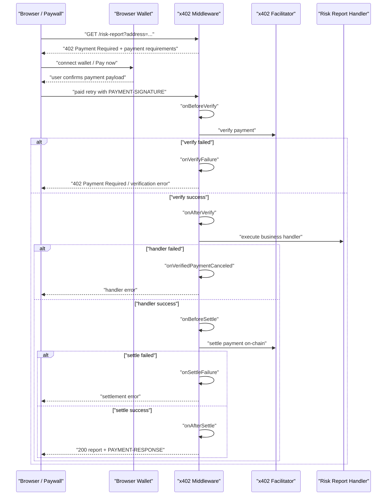
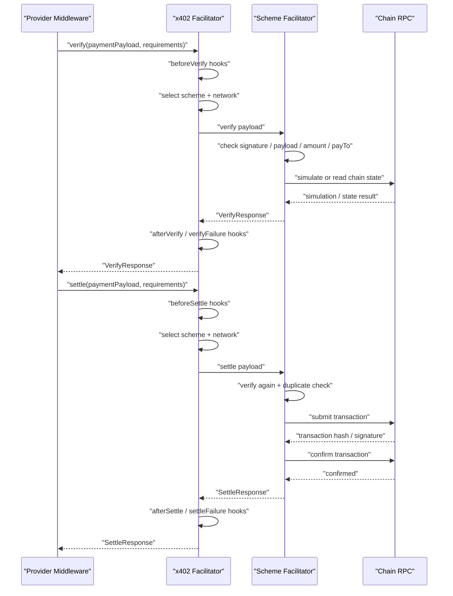

# Browser Wallet x402 Paywall Debug Notes

用途：记录 2026-06-03 使用浏览器钱包体验 `x402` 支付 `risk-report` 服务时遇到的问题、原因分析和最终结论。这个文档主要用于和 CAW `caw fetch` 流程做对比，也用于后续排查 Solana Devnet x402 支付失败。

## 1. 目标流程

浏览器钱包支付 x402 服务的正常流程是：

```text
浏览器访问付费资源
  -> Provider 返回 402 Payment Required
  -> paywall 页面读取 payment requirements
  -> 用户连接 Phantom 等浏览器钱包
  -> 用户点击 Pay now 并在钱包弹窗中确认
  -> paywall 生成 PAYMENT-SIGNATURE
  -> 浏览器带 PAYMENT-SIGNATURE 重试原资源 URL
  -> Provider verify / settle
  -> Provider 返回真实内容
```

本次测试资源：

```text
http://localhost:4021/risk-report?address=0x0000000000000000000000000000000000000001
```

## 2. Pay now 之后的完整时序

用户在页面点击 `Pay now`，并在 Phantom 等浏览器钱包弹窗里确认后，后续不是“前端直接拿内容”，而是浏览器发起一次带支付凭证的 paid retry。Provider 仍然要先校验支付，再执行业务 handler，最后发起 settlement。



这个顺序解释了两个容易误解的点：

- 钱包确认后，页面只是拿到了可提交给 x402 Provider 的支付凭证；它还需要带着 `PAYMENT-SIGNATURE` 重新请求原始资源 URL。
- 业务 handler 在 settlement 之前执行，但 x402 middleware 提供了 `onVerifiedPaymentCanceled`、`onSettleFailure` 等 hook，用于释放预占、记录失败或做补偿。真实售卖场景里，不应该把“handler 计算成功”当成最终交付成功，最终交付状态应以后续 settlement 成功为准。

最终成功返回：

```json
{
  "report": {
    "address": "0x0000000000000000000000000000000000000001",
    "riskScore": 11,
    "riskLevel": "low",
    "labels": ["low-observed-risk"],
    "generatedAt": "2026-06-03T15:32:03.420Z",
    "method": "deterministic-mock-v1"
  },
  "requestFingerprint": "sha256:d09bf930dd188cf4019d8562f419c1630656a81a39edee60c3d7e320abc9a5e1",
  "orderId": "rro_a64b801c-950b-43ed-9b27-f2979a67c462"
}
```

## 3. x402 middleware 的回调能力

本地这版 `@x402/core` 的 resource server lifecycle 主要有三组 hook：

| 阶段 | Hook | 典型用途 |
| --- | --- | --- |
| verify 前 | `onBeforeVerify` | 风控、幂等检查、库存预占检查、提前拒绝 |
| verify 成功后 | `onAfterVerify` | 记录 verified payment、绑定订单、必要时跳过 handler |
| verify 失败时 | `onVerifyFailure` | 记录失败原因、诊断支付凭证或链上模拟问题 |
| handler 失败后 | `onVerifiedPaymentCanceled` | 释放预占、标记未交付、清理临时状态 |
| settle 前 | `onBeforeSettle` | 最后检查、调整支持 partial settlement 的结算参数、提前中止 |
| settle 成功后 | `onAfterSettle` | 标记已付款、写 delivery、触发真正发货或审计记录 |
| settle 失败时 | `onSettleFailure` | 记录 settlement 失败、补偿、告警、恢复策略 |

所以可以把 x402 middleware 理解成一个类似 TCC 的交易编排器：

```text
verify 前检查
  -> verify 成功后占住业务状态
  -> handler 生成业务响应
  -> settle 上链结算
  -> settle 成功后确认最终交付
```

但要注意：x402 middleware 只是提供这些生命周期 hook，不会替业务系统自动实现库存、订单状态机、发货幂等和补偿逻辑。真实业务里应由 Provider 自己持久化 order / payment / delivery，并以后续 `onAfterSettle` 作为“可确认交付”的关键节点。

除了 resource server 的生命周期 hook，x402 还支持 extension 级别的 hook 和 enrich 能力：

- extension 可以注册自己的 verify / settle / cancel hook，只在声明了对应 extension 时执行。
- extension 可以 enrich `Payment Required` response、settlement payload、settlement response。
- 如果自建 Facilitator，facilitator 侧也有 verify / settle 前后的 hook。
- 如果写 programmatic client，client 侧还有 payment creation / payment response 相关 hook。

本 demo 当前用到的是：

- `paymentIdentifierResourceServerExtension`
- `onAfterVerify`
- `onVerifyFailure`
- `onAfterSettle`
- `onSettleFailure`

还没有使用 `onBeforeVerify`、`onBeforeSettle`、`onVerifiedPaymentCanceled`。如果后续要把它做成更真实的“先预占、后结算、再交付”模型，这几个 hook 值得补上。

## 4. Facilitator 侧执行原理

Provider 调用 Facilitator 时，调用的是 x402 的支付处理能力，而不是业务回调。核心接口可以理解成：

```text
verify(paymentPayload, paymentRequirements)
settle(paymentPayload, paymentRequirements)
```

如果 Facilitator 是远程服务，这两个能力通常表现为 Provider 向 Facilitator 发起 HTTP 请求。Provider 传入：

- `paymentPayload`：浏览器钱包或 CAW 生成的支付凭证。
- `paymentRequirements`：Provider 在 402 quote 中声明的 network、asset、amount、payTo 等要求。

Facilitator 返回：

- `VerifyResponse`：`isValid`、`payer`、`invalidReason`、`invalidMessage`。
- `SettleResponse`：`success`、`payer`、`transaction`、`network`、`errorReason`、`errorMessage`。

Facilitator 内部也有自己的生命周期编排：先根据 `x402Version`、`scheme`、`network` 选择具体的 scheme/network 实现，再执行链相关的 verify 或 settle。



### Solana exact SVM

本次测试使用的是 Solana Devnet exact SVM。它不是调用某个 x402 链上合约，而是提交标准 Solana SPL Token 转账交易。核心链上动作是 SPL Token `TransferChecked`。

`verify` 阶段会做：

```text
decode Solana transaction
  -> 检查 scheme / network
  -> 检查 requirements.extra.feePayer 是否由 Facilitator 管理
  -> 检查交易指令结构
  -> 检查 TransferChecked 指令
  -> 检查 mint / payTo 对应的 destination ATA / amount
  -> Facilitator 作为 fee payer 补签
  -> 调 Solana RPC simulateTransaction
```

`verify` 不会把交易写入链上，也不会产生真实转账。它通常会访问链/RPC 做模拟或读取链上状态，所以会暴露链状态问题。例如本次遇到的：

- `BlockhashNotFound`：模拟时 recent blockhash 已过期。
- `InvalidAccountData`：模拟 SPL token transfer 时收款 ATA 不存在或状态不对。

`settle` 阶段会做：

```text
再 verify 一次
  -> 检查 duplicate settlement
  -> Facilitator 作为 fee payer 签名
  -> sendTransaction
  -> confirmTransaction
  -> 返回 Solana transaction signature
```

Solana 费用结构：

```text
buyer / CAW wallet:
  支付 0.005 USDC

Facilitator fee payer:
  支付 Solana transaction fee
```

402 quote 中的 `extra.feePayer` 不是买家，也不是商家收款地址，而是 Facilitator 用来代付 Solana 手续费的地址。

### EVM exact

EVM exact 的链上实现不同。用户通常离线签一个 ERC-20 authorization，例如 EIP-3009 风格的 `TransferWithAuthorization` typed data。Facilitator/settler 使用自己的 EOA 发交易，调用 ERC-20 token contract 执行授权转账。

EVM `verify` 阶段通常会做：

```text
检查 scheme / network / chainId
  -> 构造 EIP-712 typed data
  -> 验证用户签名
  -> 检查 recipient / amount / validBefore / validAfter
  -> 可选模拟 token contract transferWithAuthorization
```

EVM `settle` 阶段通常会做：

```text
再 verify 一次
  -> Facilitator EOA 发交易
  -> 调 ERC-20 transferWithAuthorization
  -> 等 transaction receipt
  -> 返回 EVM transaction hash
```

EVM 费用结构：

```text
buyer:
  支付 ERC-20 USDC

Facilitator / settler EOA:
  支付 ETH gas
```

Solana 和 EVM 的共同点是 x402 对 Provider 暴露的抽象一致：`verify -> settle`。区别在于支付凭证格式、链上结算接口、手续费代付机制不同。

| 维度 | Solana exact SVM | EVM exact |
| --- | --- | --- |
| 用户签的东西 | Solana transaction / transfer payload | EIP-712 authorization |
| 链上结算动作 | 发送 Solana transaction | 调 ERC-20 token contract |
| 代付方式 | Facilitator 作为 Solana `feePayer` 补签 | Facilitator EOA 发 EVM transaction |
| 用户付什么 | SPL USDC | ERC-20 USDC |
| Facilitator 付什么 | SOL 手续费 | ETH gas |
| verify 是否真实上链 | 否，只模拟或读链状态 | 否，只验签和可选模拟 |
| settle 是否真实上链 | 是 | 是 |
| settle 返回 | Solana transaction signature | EVM transaction hash |

## 5. 和 CAW 流程的区别

网页钱包流程里，用户是在每一次付款时通过钱包弹窗确认。

CAW 流程里，安全边界前移到了 Pact：

```text
用户批准 Pact
  -> Pact 限定 chain / token / payee / amount / tx count / time window
  -> agent 调用 caw fetch
  -> caw fetch 读取 402 challenge
  -> CAW policy engine 校验 Pact
  -> 在 Pact 范围内自动支付并重试资源 URL
```

所以 `caw fetch` 不是绕过 402，而是把浏览器 paywall 中的“钱包确认和重试”自动化了。浏览器钱包确认的是单笔交易；CAW 确认的是一段受限授权。

## 6. 问题一：未安装 paywall 时只能看到提示

直接用浏览器访问资源时，页面显示：

```text
Note to developers: install @x402/paywall to enable the in-browser wallet connection and payment UI.
Programmatic clients should read the payment requirements from the 402 response headers and JSON body.
```

原因：

- Provider 可以正常返回 x402 `402 Payment Required`。
- 但没有安装和接入 `@x402/paywall` 时，浏览器没有钱包连接 UI。
- programmatic client 可以直接读取 `PAYMENT-REQUIRED` header，但普通浏览器用户无法完成支付交互。

处理：

- 安装 `@x402/paywall`。
- 在 Provider 的 x402 middleware 中配置 paywall provider。

## 7. 问题二：支付后返回 400 Bad Request

现象：

```text
Request failed: 400 Bad Request
```

原因：

- paywall 生成的 retry URL 是静态 resource URL：`http://localhost:4021/risk-report`。
- 原始访问 URL 中的 query string 被丢掉了：`?address=...`。
- Provider 第二跳收到的是 `/risk-report`，缺少 `address` 参数，因此返回：

```text
address is required
```

处理：

- 将 paywall HTML 中的 `currentUrl` 改为使用浏览器当前完整 URL。
- 实际效果是 paid retry 使用：

```text
window.location.href
```

这样第二跳保留：

```text
/risk-report?address=0x0000000000000000000000000000000000000001
```

经验：

- x402 `resource.url` 可以是规范资源地址。
- 但浏览器 paywall 的 paid retry 必须回到用户当前实际请求 URL，否则 query 参数、订单参数、业务上下文会丢失。

## 8. 问题三：Failed to fetch / 卡在 Creating payment signature

现象：

```text
Creating payment signature...
```

或：

```text
Failed to fetch
```

原因分析：

- 这类问题发生在浏览器侧生成 payment payload 阶段。
- Provider 没有收到带 `PAYMENT-SIGNATURE` 的第二跳请求。
- 早期一次本地 Node 访问 `https://api.devnet.solana.com` 出现 `ECONNRESET` / DNS 类问题，说明 Solana RPC 网络可能不稳定或被本地网络配置影响。
- Phantom 钱包弹窗没有完成、没有关闭、或没有把结果 resolve 回 paywall 页面时，页面也会一直停在 `Creating payment signature...`。

判断方式：

- Provider 调试日志只出现未支付请求：

```text
hasPaymentSignature: false
responseStatus: 402
```

- 没有出现：

```text
hasPaymentSignature: true
```

处理：

- 修复本机 Solana RPC 网络访问。
- 在 Phantom 弹窗中确认交易。
- 如果页面仍卡住，关闭或完成 Phantom notification 窗口，再刷新页面重试。
- 尽量快速确认，避免后续 blockhash 过期。

## 9. 问题四：Request failed: 402 Payment Required

现象：

```text
Request failed: 402 Payment Required
```

第一层判断：

- 这不是最初的 unpaid quote。
- Provider 已经收到了 paid retry。
- paid retry 中确实带有 `PAYMENT-SIGNATURE`。

调试日志摘要：

```text
hasPaymentSignature: true
acceptedNetwork: solana:EtWTRABZaYq6iMfeYKouRu166VU2xqa1
acceptedAmount: 5000
acceptedAsset: 4zMMC9srt5Ri5X14GAgXhaHii3GnPAEERYPJgZJDncDU
responseStatus: 402
paymentRequiredError: transaction_simulation_failed
```

进一步展开 facilitator verify：

```text
invalidReason: transaction_simulation_failed
invalidMessage: Simulation failed: "BlockhashNotFound"
```

以及：

```text
invalidReason: transaction_simulation_failed
invalidMessage: Simulation failed: {"InstructionError":["2","InvalidAccountData"]}
```

## 10. BlockhashNotFound 的原因

`BlockhashNotFound` 说明 Solana 交易中的 recent blockhash 过期或不可用。

常见触发方式：

- paywall 生成交易后，用户在 Phantom 中等待太久才确认。
- Devnet RPC 不稳定，导致 blockhash 生命周期窗口错过。

处理：

- 刷新页面重新获取 402 quote。
- 重新点击 `Pay now`。
- Phantom 弹出后尽快确认。

## 11. InvalidAccountData 的原因

本次最关键的根因是收款方 Devnet USDC ATA 不存在。

x402 SVM client 的行为：

- `payTo` 被当作 Solana wallet owner。
- client 根据 `payTo + USDC mint + token program` 推导收款方 ATA。
- client 构造 `TransferChecked` 指令。
- client 不会自动创建收款方 ATA。

如果收款方 ATA 不存在，facilitator 模拟交易时就会在 token transfer 指令上失败：

```text
InstructionError ["2","InvalidAccountData"]
```

本次排查到：

```text
Devnet USDC mint:
4zMMC9srt5Ri5X14GAgXhaHii3GnPAEERYPJgZJDncDU

browser buyer:
BNw9NEygWXuxjMzDCwy6kPFVqkqWeYqUyiYTAszVwK5k
buyer USDC ATA exists: true

old provider payTo:
Fxvz4gTxj2NMECVDD4XM3d5BGfMSv2mViyh4JFHh6oKk
derived USDC ATA:
47WSjnPZia58HBDY37a75wJ17KirzwstBtGis1gnknyF
exists: false

new provider payTo:
HFFkbafcVhwo3gnaKNECNevuy6wDnpBYBdRBRaMMYMmZ
derived USDC ATA:
DU31bBL4fKZr6ww2zyDsdx9xL6HJ35kvhzBHPBowg8Nd
exists before initialization: false
```

后来为新收款钱包创建 / 初始化 Devnet USDC ATA 后，支付成功。

## 12. 如何创建 USDC ATA

ATA 是某个钱包地址在某个 token mint 下的专属 token account。

对新收款地址：

```text
owner:
HFFkbafcVhwo3gnaKNECNevuy6wDnpBYBdRBRaMMYMmZ

Devnet USDC mint:
4zMMC9srt5Ri5X14GAgXhaHii3GnPAEERYPJgZJDncDU

derived USDC ATA:
DU31bBL4fKZr6ww2zyDsdx9xL6HJ35kvhzBHPBowg8Nd
```

创建方式：

1. 给该钱包领取一次 Solana Devnet USDC。很多 faucet 会自动创建 ATA 并打入 USDC。
2. 从已有 USDC 的钱包转一点 USDC 给该钱包。如果发送工具支持自动创建收款 ATA，交易会附带 `createAssociatedTokenAccount` 指令。
3. 用 CLI 或脚本显式创建 ATA。ATA 可以由第三方 fee payer 创建，不一定要 owner 钱包自己签名，但 fee payer 需要有 Devnet SOL 支付租金和手续费。

创建后重新查询，目标 ATA 应该变成：

```text
exists: true
```

之后 x402 SVM `TransferChecked` 模拟才能通过。

## 13. 最终结论

本次问题链条不是单一 bug，而是多个层次叠加：

- paywall 未接入时，浏览器只能看到 402 提示，不能交互支付。
- paywall 初始 retry URL 丢 query，导致支付后业务请求变成 400。
- Solana RPC 或 Phantom 弹窗状态不稳定时，页面会卡在签名阶段，Provider 收不到第二跳。
- paid retry 到达 Provider 后，x402 facilitator 会模拟交易；如果 blockhash 过期，会返回 `BlockhashNotFound`。
- 收款方 USDC ATA 不存在时，SPL token transfer 模拟失败，返回 `InvalidAccountData`。
- 初始化收款方 Devnet USDC ATA 后，浏览器钱包 x402 支付成功，Provider 返回 risk report JSON。

最重要的排查分界：

```text
Provider 没有 hasPaymentSignature: true
  -> 问题在浏览器 / 钱包 / RPC / paywall 生成 payload 阶段

Provider 有 hasPaymentSignature: true，但返回 402
  -> 问题在 x402 verify / Solana transaction simulation / settlement 阶段
```

## 14. 后续建议

- Provider 启动前检查 `PROVIDER_PAY_TO_ADDRESS` 对应的 Devnet USDC ATA 是否存在。
- 如果不存在，启动时给出明确提示，而不是等用户支付后才暴露 `InvalidAccountData`。
- paywall retry URL 应始终使用当前完整 URL，避免业务参数丢失。
- 浏览器 paywall 可以把 `PAYMENT-REQUIRED.error` 展示出来，否则用户只能看到泛化的 `Request failed: 402 Payment Required`。
- Solana 支付时尽量缩短用户确认时间，避免 `BlockhashNotFound`。
- CAW flow 和浏览器钱包 flow 都依赖同一个 Provider verify/settle 结果；如果浏览器钱包因 ATA 不存在失败，CAW 也会遇到同类链上账户准备问题。
